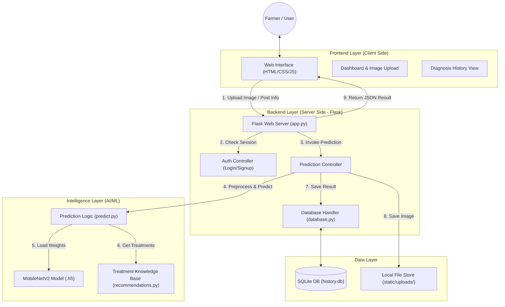

# System Architecture - AgroMind (IOMP)

AgroMind is an AI-powered crop disease diagnosis system designed to help farmers identify plant health issues in real-time. This document outlines the technical architecture, data flow, and components of the system.

## 🏛️ High-Level Architecture

The system follows a **Three-Tier Architecture** consisting of a Frontend, Backend, and Database/Storage layer, with an integrated AI Intelligence module.

---

## 🛠️ Technology Stack

| Layer | Technology | Purpose |
| :--- | :--- | :--- |
| **Frontend** | HTML5, CSS3, JavaScript | For building a responsive and interactive user dashboard. |
| **Backend** | Python, Flask | Handles routing, user sessions, and AI model integration. |
| **Database** | SQLite | Lightweight persistent storage for users and diagnosis history. |
| **AI/ML** | TensorFlow/Keras, MobileNetV2 | Deep learning model for image-based disease classification. |
| **Storage** | Local Filesystem | Stores uploaded plant leaf images. |

---

## 🔄 Core Data Flows

### 1. User Authentication
1. User submits login/signup details via the frontend.
2. Flask backend validates the data using `database.py`.
3. If valid, a session is established and the user is redirected to the Dashboard.

### 2. Disease Diagnosis (Main Flow)
1. **Upload:** User captures or uploads a leaf image on the Dashboard.
2. **Post:** JavaScript sends a POST request with the image file to `/predict`.
3. **Storage:** The server saves the image file to `static/uploads/`.
4. **Inference:** The `predict_disease` function processes the image using the Keras model.
5. **Enrichment:** The system fetches organic/chemical treatments and preventive advice from `recommendations.py`.
6. **Persistence:** The result (disease name, confidence, severity) is saved to the user's history in the SQLite database.
7. **Response:** The backend returns a JSON object containing the diagnosis and recommendations.
8. **UI Update:** The dashboard dynamically updates to show the result without a page reload.

### 3. History Retrieval
1. User navigates to the History page.
2. The frontend requests data from `/history-data`.
3. The backend queries the SQLite database for all previous records associated with the user session.
4. The JSON response is used to populate a data table/grid in the UI.

---

## 📁 System Components

### Backend Components
- **`app.py`**: The entry point. Handles HTTP routes, authentication redirects, and high-level orchestration.
- **`database.py`**: Encapsulates all SQL queries. Handles schema initialization (`init_db`) and data persistence.
- **`predict.py`**: The AI processing engine. Contains image resizing, normalization, and model prediction logic.

### Frontend Components
- **`dashboard.html`**: The primary interaction hub. Contains the image upload drag-and-drop area.
- **`style.css`**: Defines the "Glassmorphism" and modern "Agro-themed" aesthetic.
- **`index.html`**: Marketing landing page with hero sections and feature highlights.

---

## 🔒 Security & Performance
- **Authentication**: Secured via `wraps` decorator and session management.
- **File Validation**: Only specific image formats (JPG, PNG) are accepted to prevent malicious uploads.
- **Asynchronous Processing**: AJAX/Fetch is used for predictions to ensure the UI remains responsive during model inference.
